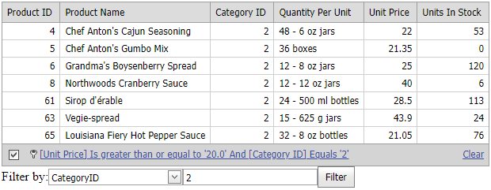

<!-- default badges list -->
[](https://supportcenter.devexpress.com/ticket/details/E4641)
[](https://docs.devexpress.com/GeneralInformation/403183)
<!-- default badges end -->

# Grid for ASP.NET Web Forms - How to programmatically change a column's filter criterion in the grid's filter expression
<!-- run online -->
**[[Run Online]](https://codecentral.devexpress.com/e4641/)**
<!-- run online end -->

This example demonstrates how to programmatically change a column's filter criterion on the server side.



In this example, editors below the grid allow users to specify a filter criterion for a column. When a user clicks the **Filter** button, the criterion is applied. Criteria applied to other columns do not change.

## Implementation Details

To programatically modify a column's filter criterion, you need to split the grid filter expression into column filter criteria. You can use the non-published `CriteriaColumnAffinityResolver.SplitByColumnNames` method for this purpose. The method receives the filter expression as a parameter and returns a value of the `Tuple<CriteriaOperator, IDictionary<string, CriteriaOperator>>` type. The tuple's first item is a criteria operator that cannot be parsed during the internal logic execution. Usually it is null. The second item is a dictionary that stores parsed criteria operators and column names.

1. Call the `SplitByColumnNames` method to get a dictionary of column filter criteria.

```csharp
var criteria = CriteriaColumnAffinityResolver.SplitByColumnNames(CriteriaOperator.Parse(targetGrid.FilterExpression)).Item2;
```

2. Change the criteria for the specified column.

```csharp
CriteriaOperator co = null;
if (FieldName == "ProductName") {
    value += "%";
    co = new FunctionOperator("Like", new OperandProperty(FieldName), new OperandValue(value));
} else
    co = new BinaryOperator(FieldName, value, BinaryOperatorType.Equal);
if (!criteria.Keys.Contains(FieldName))
    criteria.Add(FieldName, co); 
else
    criteria[FieldName] = co; 
```

3. Set the new filter expression for the grid.

```csharp
targetGrid.FilterExpression = CriteriaOperator.ToString(GroupOperator.And(criteria.Values));
```

## Files to Review

* [Default.aspx](./CS/WebSite/Default.aspx) ([Default.aspx](./VB/WebSite/Default.aspx))
* [Default.aspx.cs](./CS/WebSite/Default.aspx.cs) ([Default.aspx.vb](./VB/WebSite/Default.aspx.vb))

## Documentation

* [ASPxGridBase.FilterExpression](https://docs.devexpress.com/AspNet/DevExpress.Web.ASPxGridBase.FilterExpression)
* [Grid View - Filter Data](https://docs.devexpress.com/AspNet/3716/components/grid-view/concepts/filter-data)
* [Criteria Language Syntax](https://docs.devexpress.com/CoreLibraries/4928/devexpress-data-library/criteria-language-syntax)
* [Criteria Operators](https://docs.devexpress.com/CoreLibraries/2129/devexpress-data-library/criteria-operators)
